# EEG-based AD vs. HC Classification

Classification of Alzheimer's disease (AD) vs. healthy controls (HC) from 14-channel EPOC EEG signals, using spectral features and subject-stratified cross-validation.

---

## Repository structure

```
repo/
├── README.md
├── requirements.txt
├── src/
│   ├── preprocess_eeg.py        # EEG preprocessing (.mat → .npz)
│   └── run_ml_ad_vs_control.py  # Feature-based AD vs. HC classification
├── docs/
│   └── pipeline_description.md
└── results/                     # output directory (not tracked)
```

---

## Requirements

```bash
pip install -r requirements.txt
```

---

## Input data

**Preprocessing**  
Raw `.mat` files organised as:
```
data/raw/{HC,AD}/{condition}/subject_N.mat
```
Each file contains a 14-channel EEG array (shape `14×T` or `T×14`), in µV.

**Classification**  
A pre-computed feature matrix CSV (`data/features_ml_full.csv`) with columns:  
`file`, `subject_id`, `group`, `emotion`, plus numeric feature columns.

> Feature extraction (`.npz` → feature CSV) is not included in this repository.

---

## How to run

**Step 1 — Preprocessing**

Set `BASE_IN` and `BASE_OUT` in `src/preprocess_eeg.py`, then:
```bash
python src/preprocess_eeg.py
```

**Step 2 — Classification**

Set `CSV_PATH` and `OUT_DIR` in `src/run_ml_ad_vs_control.py`, then:
```bash
python src/run_ml_ad_vs_control.py
```

---

## Pipeline summary

```mermaid
flowchart LR
    A[Raw EEG .mat] --> B[Channel QC]
    B --> C[Spherical interpolation]
    C --> D[Notch + bandpass filter]
    D --> E[Average re-reference]
    E --> F[.npz files]
    F --> G[Feature extraction\nnot included]
    G --> H[Feature matrix CSV]
    H --> I[Band / region subsets]
    I --> J[GroupKFold CV\n5 folds by subject]
    J --> K[LR · SVM · RF · XGB · CAT]
    K --> L[SUMMARY_MASTER.csv]
```



---

## Outputs

| File | Contents |
|---|---|
| `SUMMARY_MASTER.csv` | All results across all feature blocks |
| `SUMMARY_*.csv` | Results per block (ORIGINAL, BY_BAND_POWER, BY_BAND_ALL, FRONTAL_ONLY) |
| `*__folds.csv` | Per-fold ACC, F1 (macro), AUC |
| `*__FI_mean.csv` | Mean feature importance across folds |
| `*__summary.json` | Per-model aggregated metrics |

---

## Reproducibility

- Random seed fixed at `RANDOM_STATE = 42`.
- Cross-validation grouped by `subject_id` (no subject in both train and test).
- Missing values imputed with column median, fitted on training fold only.
- No global normalisation before splitting; StandardScaler applied within each fold pipeline.
