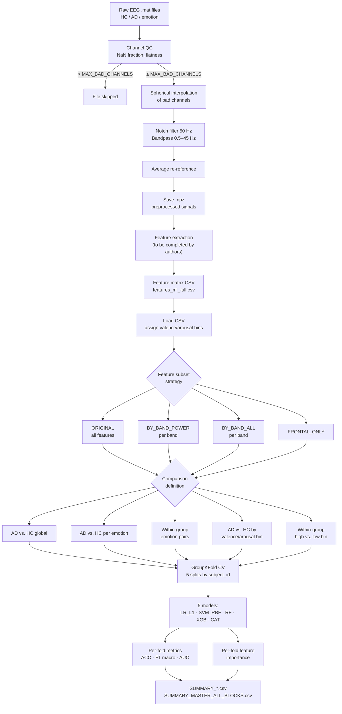

# Pipeline Description

This document describes the computational steps of the analysis pipeline as derived from the two source scripts. No interpretation of results is included.

---

## 1. Raw data loading

- Input: `.mat` files organised under `BASE_IN/{HC,AD}/{emotion}/subject_N.mat`.
- Files are loaded with `scipy.io.loadmat` (MATLAB v5/v6). If loading fails, `h5py` is used as a fallback for MATLAB v7.3 (HDF5-based) files.
- The largest 2D numeric array in each file is selected as the EEG data matrix.
- The array is transposed if necessary to enforce shape `(14 channels × T samples)`.
- If the array has 16 rows, the first 14 are retained (last 2 discarded).
- Metadata (group label, emotion label, subject ID) are parsed from the directory path.

---

## 2. Channel quality control

Applied to the raw signal before any filtering.

**Bad channel criteria (applied per channel independently):**

| Criterion | Threshold |
|---|---|
| NaN fraction | > 20% of samples (`MAX_NAN_FRAC = 0.20`) |
| Signal flatness | std (µV) < 1×10⁻⁶ (`BAD_STD_THRESH_UV = 1e-6`) |

- If the number of bad channels exceeds `MAX_BAD_CHANNELS` (default: 3), the file is skipped entirely.
- Bad channel names are recorded and stored in the output `.npz`.

---

## 3. Spherical interpolation

- Bad channels identified in step 2 are interpolated using MNE's `interpolate_bads` with `mode="accurate"` (spherical spline interpolation).
- Electrode positions follow the `standard_1020` montage.
- The 14-channel EPOC layout used: `AF3, F7, F3, FC5, T7, P7, O1, O2, P8, T8, FC6, F4, F8, AF4`.

---

## 4. Filtering

Applied in this order:

1. **Notch filter** at 50 Hz (power line interference).
2. **Bandpass filter** 0.5–45 Hz.

Both filters are applied via MNE (`notch_filter`, `filter`) on EEG channels only.

---

## 5. Re-referencing

- Average reference (`set_eeg_reference(ref_channels="average")`).

---

## 6. Output of preprocessing

- Preprocessed signals saved as compressed `.npz` files in `BASE_OUT`, mirroring the input directory structure.
- Stored arrays per file: `data` (float32, µV or V), `fs`, `ch_names`, `group`, `emotion`, `subject_id`, `src_file`, `src_key`, `units`, `filters`, `reref`, `interp_method`, `bad_channels_initial`.

---

## 7. Feature extraction

> **Note:** This step is not implemented in the provided scripts. The classification script takes a pre-computed feature matrix CSV as input (`features_ml_full.csv`). The feature extraction procedure — transforming preprocessed `.npz` files into this CSV — is to be completed by the authors.

---

## 8. Feature matrix loading and preparation

- CSV must contain: `file`, `subject_id`, `group`, `emotion`, plus numeric feature columns.
- `group` values are normalised: `1 / "ad" / "alzheimer"` → 1 (AD); otherwise → 0 (HC).
- `emotion` values are lowercased and spaces replaced with underscores.
- **Valence bin** assignment:
  - `high`: affection, amusement
  - `low`: anger, fear, sadness
  - NA: neutral, alzheimer (and any emotion not in either set)
- **Arousal bin** assignment:
  - `high`: amusement, anger, fear
  - `low`: affection, sadness
  - NA: neutral, alzheimer (and any emotion not in either set)
- Feature columns: all numeric columns not in the metadata set, retaining only those with at least one non-NaN value.
- An optional regex filter (`FEATURE_REGEX_KEEP`) can restrict the feature set; default is `None` (all features kept).

---

## 9. Feature subset strategies

Four feature subsets are evaluated independently:

| Block | Strategy | Selection logic |
|---|---|---|
| ORIGINAL | All numeric features | No filtering |
| BY_BAND_POWER | Per-band power features | abs\_, rel\_, d\_abs\_, d\_rel\_ matching the band name; cross-band ratios for alpha/theta/beta |
| BY_BAND_ALL | All per-band features | Broader name match on band token; includes all features with the band name anywhere in the column name |
| FRONTAL_ONLY | Frontal channel features | Columns with `_frontal` suffix, known frontal scalars (FAI\_alpha, theta/beta ratios), or last token matching a frontal channel name |

Frequency bands: delta, theta, alpha, beta, gamma.  
Frontal channels: `AF3, F7, F3, FC5, FC6, F4, F8, AF4`.

---

## 10. Comparison definitions

For each feature subset, the following comparisons are run:

| Comparison type | Definition |
|---|---|
| AD vs. HC global | All rows, binary label = group |
| AD vs. HC per emotion | Rows filtered to one emotion condition; binary label = group |
| Within-group emotion pairs | Rows of one group (HC or AD); all pairwise combinations of emotion conditions; binary label = emotion |
| AD vs. HC — valence high | Rows where `valence_bin == "high"`; binary label = group |
| AD vs. HC — valence low | Rows where `valence_bin == "low"`; binary label = group |
| AD vs. HC — arousal high | Rows where `arousal_bin == "high"`; binary label = group |
| AD vs. HC — arousal low | Rows where `arousal_bin == "low"`; binary label = group |
| Within-group valence high vs. low | Rows of one group; binary label = valence bin |
| Within-group arousal high vs. low | Rows of one group; binary label = arousal bin |

---

## 11. Cross-validation scheme

- **Method:** GroupKFold, `n_splits = 5`.
- **Grouping variable:** `subject_id`. No subject appears in both training and test sets within a fold.
- Folds where the training or test set contains only one class are skipped silently.
- Missing values are imputed with the column **median**, computed on the training fold only (within-pipeline).

---

## 12. Models evaluated

| Key | Model | Notes |
|---|---|---|
| LR\_L1 | Logistic Regression, L1 penalty | `liblinear` solver, C=1.0, max\_iter=4000, class\_weight="balanced" |
| SVM\_RBF | SVM, RBF kernel | C=1.0, gamma="scale", class\_weight="balanced", probability=True |
| RF | Random Forest | 600 trees, min\_samples\_leaf=2, class\_weight="balanced\_subsample" |
| XGB | XGBoost | 400 trees, max\_depth=4, lr=0.05, subsample=0.7, importance\_type="gain" |
| CAT | CatBoost | 600 iterations, depth=5, lr=0.05, l2\_leaf\_reg=3.0 |

All pipelines: imputer → (scaler for LR/SVM) → classifier.  
`random_state = 42` for all stochastic components.

---

## 13. Performance metrics

Computed per fold; aggregated as mean ± std across valid folds:

| Metric | Notes |
|---|---|
| Accuracy (ACC) | `sklearn.metrics.accuracy_score` |
| F1 macro (F1) | `sklearn.metrics.f1_score(average="macro")` |
| AUC | `sklearn.metrics.roc_auc_score`; uses `predict_proba` if available, else normalised decision function |

---

## 14. Feature importance

Computed per fold and averaged across folds:

| Model | Method |
|---|---|
| LR\_L1 | Absolute fitted coefficient values |
| SVM\_RBF | Permutation importance (5 repeats, f1\_macro, test set) |
| RF | `feature_importances_` (mean decrease in impurity) |
| XGB | `feature_importances_` (gain-based, set at model definition) |
| CAT | `get_feature_importance()` |

---

## 15. Output files

| File pattern | Contents |
|---|---|
| `*__folds.csv` | Per-fold ACC, F1, AUC |
| `*__FI_fold{N}.csv` | Feature importance for fold N |
| `*__FI_mean.csv` | Mean feature importance across folds |
| `*__summary.json` | Aggregated metrics dict (mean, std, n\_folds\_valid, n\_rows, n\_features\_input) |
| `SUMMARY_*.csv` | Aggregated results for a block, sorted by comparison and F1\_mean |
| `SUMMARY_MASTER_ALL_BLOCKS.csv` | All results combined across all four feature subset blocks |

---

## Flow diagram

